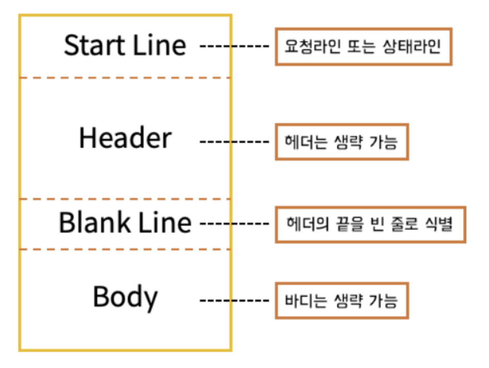
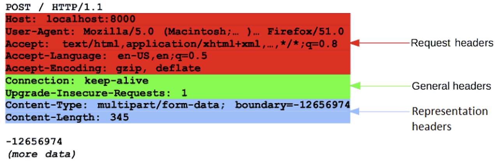
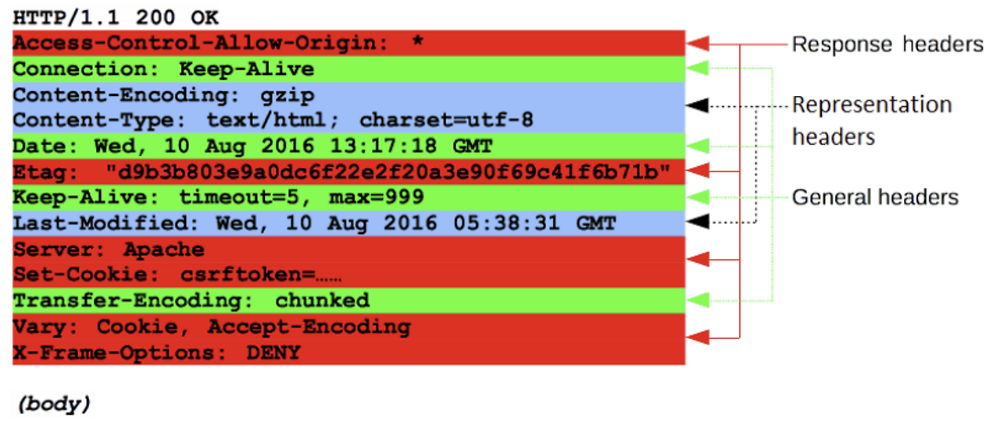

# HTTP의 메시지

HTTP 메시지는 클라이언트와 서버 사이에서 데이터를 주고받는 방식이다.  
크게 두 가지 타입으로 나뉜다:

- **Request (요청)**: 클라이언트가 서버에 보내는 메시지
- **Response (응답)**: 서버가 클라이언트에게 보내는 메시지

HTTP 메시지는 **ASCII 인코딩된 텍스트**로 구성되며, 설정 파일, API, 브라우저 등을 통해 전달된다.

---

## HTTP 메시지 구조

요청과 응답의 구조는 유사하며, 다음과 같은 네 가지 요소로 구성된다:

1. **Start Line**: 요청 또는 응답의 상태를 나타내는 첫 줄  
2. **HTTP Header**: 요청/응답에 대한 부가 정보를 담는 헤더 집합  
3. **Blank Line**: 헤더와 본문을 구분하는 빈 줄  
4. **Body**: 요청 또는 응답과 관련된 실제 데이터  

---

## 📤 Request (요청 메시지)

### 1. Start Line

- **HTTP Method**: `GET`, `POST`, `PUT` 등 요청 방식 지정  
- **Request Target**: 요청 대상(URL/URI 또는 절대 경로)  
- **HTTP Version**: 예: `HTTP/1.1`, `HTTP/2`  

---

### 2. Header

- 형식: `헤더이름: 값`  
- 대소문자 구분 없음

#### 헤더 그룹

- **Request Headers**: `User-Agent`, `Accept-Type`, `Accept-Language`, `Referer`, `If-None-Match` 등  
- **General Headers**: 전체 메시지에 공통적으로 적용  
- **Entity Headers**: 메시지 본문에 대한 정보 포함 (Body가 비어있으면 전송되지 않음)  

---

### 3. Body

- 요청에 포함되는 실제 데이터  
- 모든 요청에 필요한 것은 아님  
- 주로 `POST` 요청에 사용되며, HTML 폼 데이터 등이 포함됨  

---

## 📥 Response (응답 메시지)

### 1. Start Line

- **HTTP Version**  
- **Status Code**: `200`, `404`, `500` 등 요청 결과를 나타냄  
- **Status Text**: `OK`, `Not Found` 등 상태 코드 설명  

---

### 2. Header

- 요청 헤더와 동일한 형식  
- 몇 가지 그룹으로 나뉨

#### 헤더 그룹

- **General Headers**: 전체 메시지에 적용  
- **Response Headers**: `Vary`, `Accept-Ranges` 등 추가 정보 제공  
- **Entity Headers**: 응답 Body에 대한 정보 포함 (Body가 없을 경우 전송되지 않음)  

---

### 3. Body

- 응답 데이터 포함 (HTML, JSON 등)  
- 상태 코드가 `201`, `204`인 경우 Body 생략 가능  
