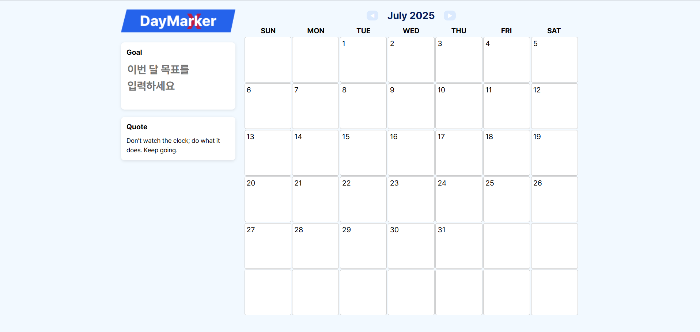
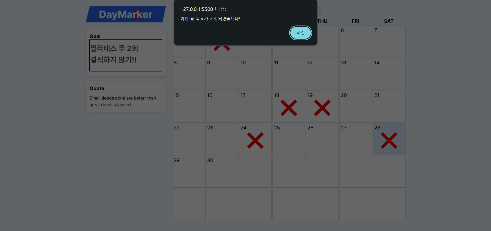
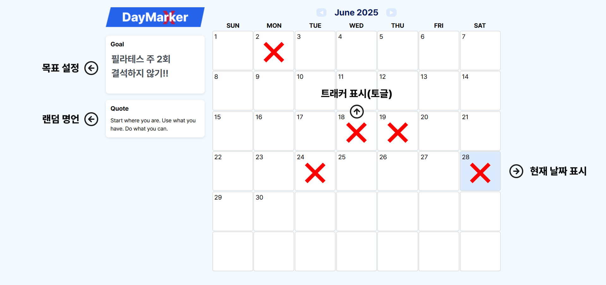

# 📌 프로젝트명: DayMarker

> HTML/CSS/JavaScript 수업 중 제작한 스몰 프로젝트입니다.  
> 기초 개념 적용과 실습을 통해 기술 습득을 목표로 하였습니다.

---

## 📆 프로젝트 기간

- 시작일: 2025.06.27
- 종료일: 2025.06.28

---

## 🎯 주요 목표

- ✅ 월별 달력 자동 렌더링
- ✅ 오늘 날짜 강조 및 시각 표시
- ✅ 날짜별 트래커 체크 표시 (❌ 토글)
- ✅ 로컬스토리지 기반 데이터 저장
- ✅ 월 목표 입력 및 저장
- ✅ 랜덤 명언 출력 기능

---

## ⚙️ 사용 기술 스택

| 분류     | 기술명                            |
|--------|----------------------------------|
| 프론트엔드 | HTML, CSS, JavaScript |
| 기타     | Git, GitHub     |

---

## 🧱 프로젝트 구조

```bash
📁 01_DayMarker/
├── index.html        # 메인 HTML
├── daymarker.css     # 전체 스타일
├── daymarker.js      # 날짜 렌더링 & 로직
├── logo.png          # DayMarker 로고
└── README.md         # 프로젝트 소개 문서
```

---

## 💡 주요 기능 설명

### 🗓️ 기능 1: 달력 렌더링
- 현재 월 기준 7x6 격자 달력 자동 생성
- 월 이동 버튼(◀ ▶) 클릭 시 이전/다음 달 렌더링
- 오늘 날짜는 연한 파란색 배경으로 강조

### ❌ 기능 2: 날짜 트래커
- 날짜 셀 클릭 시 빨간 ❌ 마크 표시
- 다시 클릭하면 ❌ 제거 (토글 방식)
- ❌ 정보는 로컬스토리지에 **월별로 저장**됨

### 🎯 기능 3: 월 목표 입력
- 사이드바에 목표 입력창(`textarea`) 제공
- `Enter` 키 입력 시 해당 월 목표가 저장됨
- 월 변경 시 저장된 목표 불러오기

### 💬 기능 4: 랜덤 명언 표시
- 새로고침 또는 월 이동 시 명언 한 줄 무작위 표시
- 명언은 자극적이지 않으면서도 실습용으로 가볍게 구성됨

---

## 🖼️ 데모 화면

### ✅ 메인화면  
  
사용자 목표 입력, 명언 표시, 달력 구조가 포함된 기본 화면입니다.

---

### ✅ 목표 설정 시 안내  
  
목표 입력 후 `Enter` 키를 누르면 로컬스토리지에 저장되고, 저장 완료 알림이 표시됩니다.

---

### ✅ 트래커 ❌ 표시 + 현재 날짜 강조  
  
❌ 클릭 토글 방식으로 데일리 완료 상태를 기록할 수 있으며,  
오늘 날짜는 연한 파란색 배경으로 표시되어 시각적으로 구분됩니다.

---

## 🧠 회고 요약

### ❓ 어려웠던 점
- 날짜 격자를 고정 크기로 유지하면서도 월별 일 수와 시작 요일을 정확히 배치하는 부분
- ❌ 표시 상태를 월별로 로컬스토리지에 저장하고 불러오는 구조 설계

### ✨ 배운 점
- 날짜 관련 JavaScript 내장 객체 활용 (`Date`, `getDay()`, `getDate()` 등)
- 로컬스토리지 상태 유지 방식과 배열 저장/불러오기 처리
- HTML/CSS만으로 깔끔한 레이아웃 구현 (Flex/Grid, 버튼 스타일링 등)

### 🔧 보완하고 싶은 점
- 하루에 여러 개의 할 일을 관리할 수 있는 **투두리스트 기능** 추가
- **반응형 디자인** 적용 (모바일 대응)
- ❌ 외에 **색상/체크 아이콘 등 다양한 마커 기능** 추가
