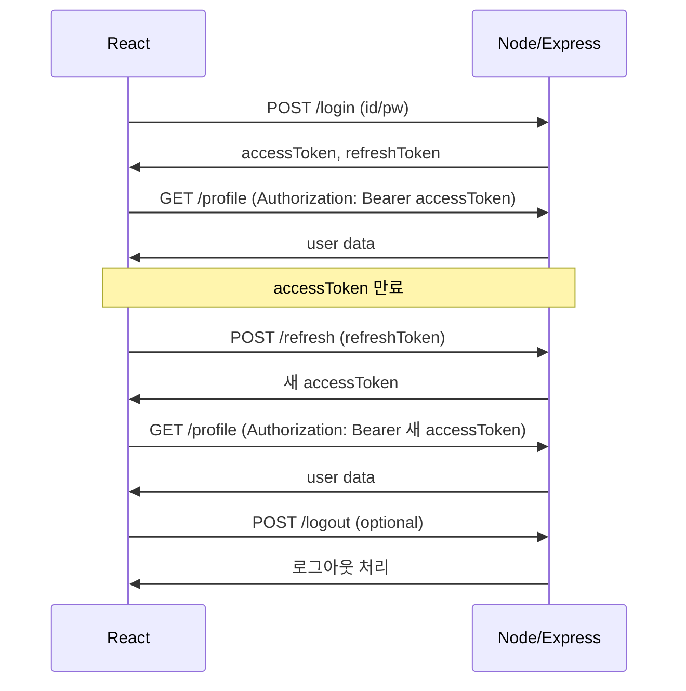

# 📚 JWT (Json Web Token) 개념, 역사, 등장 배경

---

## 1. JWT란 무엇인가?

**JWT(Json Web Token)**

* 사용자를 인증(verify)하고, 정보를 안전하게 주고받기 위해 설계된 “토큰 기반 인증” 포맷
* **URL-safe한 문자열**(Base64 인코딩)
* 세 부분으로 구성:
  **Header**.**Payload**.**Signature**

---

### ✅ JWT 구조

```text
xxxxx.yyyyy.zzzzz
```

* **Header**: 타입(JWT) + 해시 알고리즘 정보
* **Payload**: 실제 데이터(Claims, 즉 “주장”)
* **Signature**: Header + Payload를 비밀키로 서명, 변조 방지

---

## 2. JWT의 등장 배경

### 🔍 전통적인 인증(세션/쿠키)의 한계

* 웹 초창기: 사용자가 로그인하면 \*\*세션(session)\*\*을 서버에 저장
  → 서버 메모리(또는 DB)에 상태 보관
* 브라우저는 **쿠키**에 세션ID 저장 → 요청할 때마다 세션ID 전송
* **문제점**

  * 서버마다 “상태”를 기억해야 함 (scalability 문제)
  * 부하 분산(로드 밸런싱) 시 “세션 공유/복제”가 필요
  * 모바일/SPA(싱글페이지앱) 등 다양한 환경에서 불편
  * 서버 비용 증가, 글로벌 서비스에서 한계

---

### 💡 토큰 기반 인증(Token-based Authentication)의 필요성

* **Stateless(비상태성) 인증**을 원하는 시대 도래
* 인증 정보를 **클라이언트가 토큰 형태로 직접 보유**
* 서버는 토큰의 유효성만 검증 → 상태 저장X
* **분산 시스템, 마이크로서비스, 모바일 앱**에서 효율적

---

## 3. JWT의 역사와 표준화

* **2010년대 초반**: OAuth2, OpenID Connect 등 표준 인증 프로토콜 등장
  → RESTful API, SPA, 모바일앱 급증
* **2015년**: JWT가 IETF(Internet Engineering Task Force)에서
  **RFC 7519**로 공식 표준화
* “누구나 쉽게 구현할 수 있는, 표준화된 토큰 포맷” 제공

---

## 4. JWT가 각광받는 이유

* **Stateless**: 서버 확장/분산에 최적화
* **Cross-platform**: 모바일/SPA/IoT 등 다양한 환경에 유리
* **Self-contained**: 토큰만으로 사용자 정보, 권한 등을 판단 가능
* **확장성**: 소셜로그인(OAuth2), 마이크로서비스 통합, 인증/인가 분리
* **보안**: 서명(Signature)으로 변조 방지, https 사용 필수

---

## 5. JWT가 도입된 후 변화

* 서버가 “상태”를 기억하지 않으니 **스케일 아웃/글로벌 서비스**에 적합
* SPA, 모바일, 사내/외부 API 등
  “클라이언트 다양화 + 서버 분산” 시대의 실질 표준
* OAuth2/OpenID Connect 등에도 **JWT**가 핵심 역할
* 보안 이슈(XSS, 탈취, 만료/재발급 관리)는 여전히 중요
  → 실무에선 **Refresh Token, httpOnly Cookie, 만료 관리**까지 필수

---

## 💬 정리

* **JWT**는 “토큰 기반 인증” 시대의 대표적인 표준 포맷
* 현대적인 웹/모바일/마이크로서비스 환경에서
  \*\*“인증의 디폴트”\*\*로 자리잡음
* “왜 JWT인가?”:
  → **확장성, 분산성, 플랫폼 다양성**을 동시에 만족시키기 때문

---

# 📚 Express/Node + React 실전 JWT 인증

---

## 1. 전체 인증 흐름 한눈에 보기

```
[React 클라이언트]  ←→  [Express/Node 서버]  ←→  [MongoDB 등 DB]
        │                        │
     (회원가입/로그인 폼)   ←→   (JWT 토큰 발급/검증)
        │                        │
[Access/Refresh Token 저장 및 활용]
        │
    (보호 라우트 접근/자동 로그인/로그아웃)
```

---

## 2. 백엔드: Express/Node에서 JWT 토큰 발급

### 1) 주요 라이브러리 설치

```sh
npm install express jsonwebtoken bcryptjs cors
```

### 2) User 모델 예시 (Mongoose)

```js
const mongoose = require('mongoose');

const userSchema = new mongoose.Schema({
  email: { type: String, required: true, unique: true },
  password: { type: String, required: true }
});
module.exports = mongoose.model('User', userSchema);
```

### 3) 회원가입/로그인 API 구현

```js
const express = require('express');
const jwt = require('jsonwebtoken');
const bcrypt = require('bcryptjs');
const User = require('./models/User');
const router = express.Router();

const JWT_SECRET = 'YOUR_SECRET_KEY';
const JWT_EXPIRES_IN = '15m'; // 액세스 토큰 만료
const REFRESH_SECRET = 'YOUR_REFRESH_KEY';
const REFRESH_EXPIRES_IN = '7d';

let refreshTokens = []; // (실습용, 실무는 DB나 Redis 사용)

router.post('/register', async (req, res) => {
  const { email, password } = req.body;
  const hash = await bcrypt.hash(password, 10);
  await User.create({ email, password: hash });
  res.json({ message: '회원가입 완료' });
});

router.post('/login', async (req, res) => {
  const { email, password } = req.body;
  const user = await User.findOne({ email });
  if (!user || !(await bcrypt.compare(password, user.password))) {
    return res.status(401).json({ message: '인증 실패' });
  }
  const accessToken = jwt.sign({ id: user._id, email: user.email }, JWT_SECRET, { expiresIn: JWT_EXPIRES_IN });
  const refreshToken = jwt.sign({ id: user._id }, REFRESH_SECRET, { expiresIn: REFRESH_EXPIRES_IN });
  refreshTokens.push(refreshToken);
  res.json({ accessToken, refreshToken });
});
```

---

### 4) 토큰 검증 미들웨어 (보호 API 예시)

```js
function authMiddleware(req, res, next) {
  const token = req.headers['authorization']?.split(' ')[1];
  if (!token) return res.sendStatus(401);
  try {
    const user = jwt.verify(token, JWT_SECRET);
    req.user = user;
    next();
  } catch (err) {
    return res.sendStatus(403); // 만료 or 변조
  }
}

// 보호 라우트 예시
router.get('/profile', authMiddleware, async (req, res) => {
  const user = await User.findById(req.user.id).select('-password');
  res.json(user);
});
```

---

### 5) 리프레시 토큰으로 AccessToken 재발급

```js
router.post('/refresh', (req, res) => {
  const { refreshToken } = req.body;
  if (!refreshTokens.includes(refreshToken)) return res.sendStatus(403);
  try {
    const user = jwt.verify(refreshToken, REFRESH_SECRET);
    const newAccessToken = jwt.sign({ id: user.id }, JWT_SECRET, { expiresIn: JWT_EXPIRES_IN });
    res.json({ accessToken: newAccessToken });
  } catch (err) {
    return res.sendStatus(403);
  }
});
```

---

## 3. 프론트엔드: React에서 JWT 인증 흐름

### 1) 인증 상태 관리 구조

* 로그인/회원가입 → 토큰 저장 (`localStorage` or `cookie`)
* Axios 인터셉터로 토큰 자동 전송
* ProtectedRoute로 인증 체크
* 토큰 만료 시 자동 재발급(Refresh)
* 로그아웃 시 토큰 삭제

---

### 2) 예시 코드 (핵심 부분)

#### 로그인/회원가입 요청

```tsx
// 로그인 예시
const handleLogin = async () => {
  const { data } = await axios.post('/api/login', { email, password });
  localStorage.setItem('accessToken', data.accessToken);
  localStorage.setItem('refreshToken', data.refreshToken);
  setAuthState({ isAuth: true, user: parseJwt(data.accessToken) });
};
```

#### Axios 인터셉터 (토큰 자동 전송/재발급)

```js
import axios from 'axios';

const api = axios.create({ baseURL: '/api' });

api.interceptors.request.use((config) => {
  const token = localStorage.getItem('accessToken');
  if (token) config.headers.Authorization = `Bearer ${token}`;
  return config;
});

// 응답에서 토큰 만료 체크 → 자동 재발급
api.interceptors.response.use(undefined, async (error) => {
  if (error.response.status === 403) {
    // 토큰 만료 시 refresh 요청
    const refreshToken = localStorage.getItem('refreshToken');
    const { data } = await axios.post('/api/refresh', { refreshToken });
    localStorage.setItem('accessToken', data.accessToken);
    error.config.headers.Authorization = `Bearer ${data.accessToken}`;
    return axios(error.config); // 원래 요청 재시도
  }
  return Promise.reject(error);
});
```

#### 인증 상태에 따라 보호 라우트(ProtectedRoute) 적용

```tsx
import { Navigate } from 'react-router-dom';

function ProtectedRoute({ children }) {
  const isAuth = !!localStorage.getItem('accessToken');
  return isAuth ? children : <Navigate to="/login" />;
}
```

#### 로그아웃 처리

```tsx
const handleLogout = () => {
  localStorage.removeItem('accessToken');
  localStorage.removeItem('refreshToken');
  setAuthState({ isAuth: false, user: null });
};
```

---

## 4. 실습에서 주의할 점 & 베스트 프랙티스

* **JWT 비밀키는 .env에 보관!** (Git에 올리지 않기)
* **httpOnly 쿠키** 사용 권장(실무, XSS 방지)
* Refresh Token은 **DB나 Redis에 저장**해서 탈취 대응
* **HTTPS 환경 필수**
* 토큰 탈취/재발급 로직 실수 없도록
* 에러 핸들링/만료처리/UX 설계도 신경쓸 것

---

## 5. 인증 흐름도 (도식)



---

## 6. 마무리 & 실전 적용 팁

* **React + Node 실습으로 JWT 인증 흐름 전체를 경험**
* 확장시엔 OAuth2, 소셜 로그인, Multi-factor 인증도 적용 가능
* 인증 실패, 만료, UI 상태처리까지 꼭 챙기기
* 토큰 저장위치/보안 전략은 실무와 환경에 맞춰 적용

---


# 🗝️ Access Token과 Refresh Token 정리

---

## 1. Access Token

| 구분          | 설명                                                             |
| ----------- | -------------------------------------------------------------- |
| **정의**      | 인증(로그인)된 사용자의 신원을 증명하는 **1회용 티켓**                              |
| **용도**      | 매 API 요청 시 서버가 사용자를 식별하고 권한을 체크하는 데 사용                         |
| **유효기간**    | **짧다** (몇 분 \~ 수십 분: 보통 5\~30분, 최대 1시간 이하 권장)                  |
| **저장위치**    | 클라이언트(브라우저) 쪽: localStorage, sessionStorage, httpOnly Cookie 등 |
| **노출/탈취시**  | 짧은 시간 동안만 위험, 곧 만료됨                                            |
| **Payload** | 최소한의 사용자 정보(유저ID 등), 권한, 만료정보 등 포함                             |
| **만료시**     | 더 이상 API 호출 불가 → Refresh Token으로 새로 발급 받아야 함                   |
| **보안상 권장**  | 민감정보 X, 만료 짧게, https 전송, httpOnly 쿠키 추천                        |

---

## 2. Refresh Token

| 구분          | 설명                                                     |
| ----------- | ------------------------------------------------------ |
| **정의**      | Access Token이 만료됐을 때 **새 Access Token을 발급받기 위한 장기 티켓** |
| **용도**      | 서버에 “나 인증 유지할래!” 요청 시 제출 → 새로운 Access Token 발급         |
| **유효기간**    | **길다** (수일\~수주: 보통 7일, 14일, 30일 등)                     |
| **저장위치**    | **반드시 httpOnly, Secure 쿠키**(XSS 방어), 서버(DB/Redis)에도 보관 |
| **노출/탈취시**  | 장기 위험! 장기 세션 탈취 가능 → DB로 관리, IP/기기 식별, 로그아웃시 폐기        |
| **Payload** | 최소한의 정보(유저ID 등)만, 민감정보 X                               |
| **만료시**     | 재로그인 필요(로그인 폼 재요청)                                     |
| **보안상 권장**  | 탈취 방지(쿠키, DB, 단말정보 식별, 1회성 사용 ROTATE)                  |

---

## 3. 두 토큰의 관계와 실무 흐름

1. **로그인 성공 →**
   서버가 *Access Token*과 *Refresh Token*을 동시에 발급
   (Access는 짧게, Refresh는 길게)

2. **API 요청 →**
   Access Token으로 인증

3. **Access Token 만료 →**
   Refresh Token을 서버에 제출, 새 Access Token 발급

4. **Refresh Token도 만료 →**
   로그인 폼으로 돌아감(재인증 필요)

---

## 4. 실무 팁

* **Access Token**은 “신분증”,
  **Refresh Token**은 “재발급권”처럼 이해하면 쉽다.
* Refresh Token은 반드시 DB(혹은 Redis)에 저장해서
  *로그아웃/탈취/재사용 감지* 시 바로 무효화할 수 있도록 관리!
* *Refresh Token*은 노출/탈취시 장기 피해를 줄 수 있으니
  httpOnly 쿠키, 서버 측 관리, 사용자 환경(IP/기기 등) 식별 등
  별도 보안 강화 필요.

---

### 💡 표로 요약

| 구분        | Access Token        | Refresh Token               |
| --------- | ------------------- | --------------------------- |
| **역할**    | API 인증, 식별          | 새 Access 발급(연장권)            |
| **유효기간**  | 짧음 (5\~30분)         | 김 (7\~30일)                  |
| **저장위치**  | localStorage/cookie | httpOnly, Secure 쿠키 + 서버 DB |
| **노출 위험** | 만료까지 짧게 노출          | 장기 노출 위험, 탈취시 즉시 회수 필요      |
| **만료 시**  | Refresh로 연장         | 재로그인 필요                     |
| **실무 관리** | 민감정보 금지, HTTPS 필수   | 1회성/로테이션, 서버측 무효화 관리        |

---

**궁극적으로, 두 토큰의 조합이 “보안성과 UX” 모두를 책임지는 현대 인증의 핵심입니다!**


# 🛡️ XSS (Cross-Site Scripting) 공격이란?

**XSS**는 웹 애플리케이션의 입력 필드에 악성 스크립트를 삽입해, **브라우저에서 사용자 모르게 실행되도록 만드는 공격**입니다.
주로 사용자의 **쿠키 탈취, 세션 하이재킹, 피싱 유도, 클릭재킹** 등의 목적으로 사용됩니다.

---

## 🎯 주요 목표

* 사용자 인증 정보 탈취 (ex. 쿠키, JWT)
* 악성 행위 수행 (ex. 자동 클릭, 내부 API 호출)
* 악성 사이트로 리디렉션
* 브라우저에 악성 스크립트 주입 (예: 광고 삽입, CSRF 수행)

---

## 🧨 XSS의 대표적인 유형

| 유형                       | 설명                                        | 예시                          |
| ------------------------ | ----------------------------------------- | --------------------------- |
| **1. 저장형(Persistent)**   | 악성 스크립트가 DB 등에 저장되어 다수 사용자에게 실행됨          | 게시판 댓글에 `<script>` 삽입       |
| **2. 반사형(Reflected)**    | 사용자의 요청 URL에 스크립트를 포함 → 서버가 그대로 응답        | 검색 쿼리에 악성 JS 삽입             |
| **3. DOM 기반(DOM-based)** | 클라이언트 사이드 JavaScript에서 조작된 데이터를 HTML에 렌더링 | `location.hash` → innerHTML |

---

## 🧪 예시

### 1️⃣ 저장형 XSS 예시 (게시판 댓글)

```html
<!-- 공격자가 댓글에 남김 -->
<script>alert('XSS 공격!');</script>
```

사용자가 이 댓글이 포함된 게시글을 보면, **브라우저가 그대로 실행**합니다.

---

### 2️⃣ 반사형 XSS 예시 (URL 기반)

```http
GET /search?q=<script>steal()</script>
```

서버가 다음처럼 응답하면 공격 성공:

```html
<p>검색어: <script>steal()</script></p>
```

---

### 3️⃣ DOM 기반 XSS 예시

```js
const query = location.hash; // URL 해시
document.getElementById('result').innerHTML = query; // ❌ XSS 취약
```

공격자 URL:

```
https://example.com/#
```

---

## 🎯 XSS로 가능한 공격

* `document.cookie`를 훔쳐서 세션 탈취
* `XMLHttpRequest`로 내부 API 호출 시도
* `window.location` 조작으로 피싱 유도
* `keylogger` 삽입
* 광고 삽입, 사기성 팝업 등

---

## 🛡️ 방어 방법

| 방법                                  | 설명                                                       |
| ----------------------------------- | -------------------------------------------------------- |
| ✅ **출력 인코딩(Escaping)**              | `<`, `>`, `"`, `'` 등을 HTML 엔티티로 변환 (예: `&lt;`)           |
| ✅ **입력 필터링/검증**                     | 스크립트 태그, 이벤트 핸들러 (`onload`, `onerror` 등) 제거              |
| ✅ **Content Security Policy (CSP)** | 외부 스크립트 차단, inline script 제한                             |
| ✅ **innerText, textContent 사용**     | `innerHTML` 대신 안전한 방식으로 삽입                               |
| ✅ **httpOnly 쿠키**                   | JS에서 접근 불가능하게 쿠키 설정 (`Set-Cookie: HttpOnly`)             |
| ✅ **React/Vue/Angular 사용**          | 기본적으로 자동 escaping 처리됨 (단, `dangerouslySetInnerHTML`은 주의) |

---

## 🔍 React에서의 대응

React는 기본적으로 XSS에 안전한 렌더링을 제공합니다:

```tsx
const name = "<script>alert('xss')</script>";
<p>{name}</p> // ❌ 실행되지 않음 (자동 이스케이프)
```

그러나 아래는 위험합니다:

```tsx
<div dangerouslySetInnerHTML={{ __html: userInput }} /> // ❌ 위험!
```

---

## 📌 요약

| 항목    | 설명                                         |
| ----- | ------------------------------------------ |
| 공격명   | XSS (Cross Site Scripting)                 |
| 위험    | 사용자 쿠키 탈취, 악성 스크립트 실행                      |
| 주요 경로 | 사용자 입력 → 미필터링된 HTML 출력                     |
| 방어법   | 인코딩, CSP, 필터링, innerText 사용, httpOnly 쿠키 등 |